# ClickbaitDetection

Lightweight web app that analyzes a news URL and estimates clickbait/deceptive framing using content extraction + heuristic NLP-style scoring.


## What It Does

- Fetches article HTML from a given URL.
- Extracts headline, readable body text, metadata, and supporting sentences.
- Detects clickbait patterns and deception hints.
- Computes a composite risk score with explainable signal breakdown.
- Renders a visual results dashboard with verdict, confidence, and metrics.

## Quick Start

```bash
cd /Users/slender/Developer/Codes/ClickbaitDetection
npm install
npm start
```

Open: `http://localhost:3000`

If port 3000 is already in use:

```bash
lsof -ti tcp:3000 | xargs kill -9
npm start
```

## Architecture

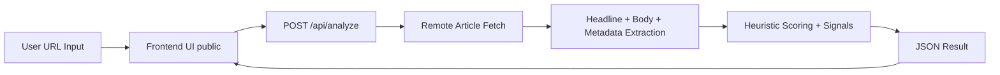

## API

### `POST /api/analyze`

Request:

```json
{ "url": "https://example.com/article" }
```

Key response fields:

- `verdict`
- `composite_sensationalism_score`
- `legitimacy_confidence_score`
- `headline`
- `body_snippet`
- `signals`
- `score_breakdown`
- `cosine_similarity_score`
- `sentiment_polarity`

## Project Structure

```text
ClickbaitDetection/
   public/
      index.html
      script.js
      styles.css
   src/
      server.js
   package.json
```

## Screenshots

### Web App UI

1. Home screen and URL input

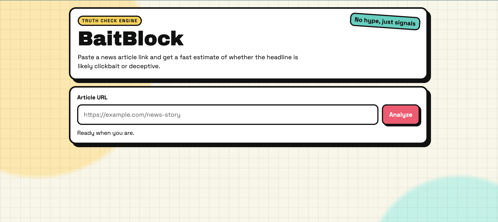

2. Analysis completed with verdict and top-level result cards

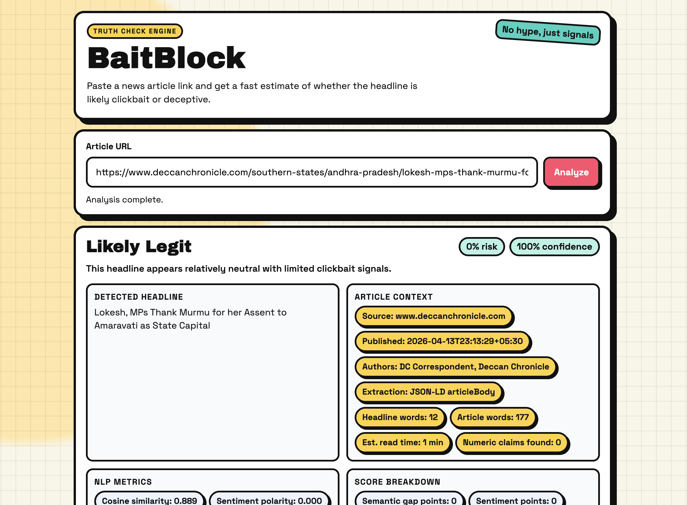

3. Mid-page diagnostics: NLP metrics, score breakdown, body snippet

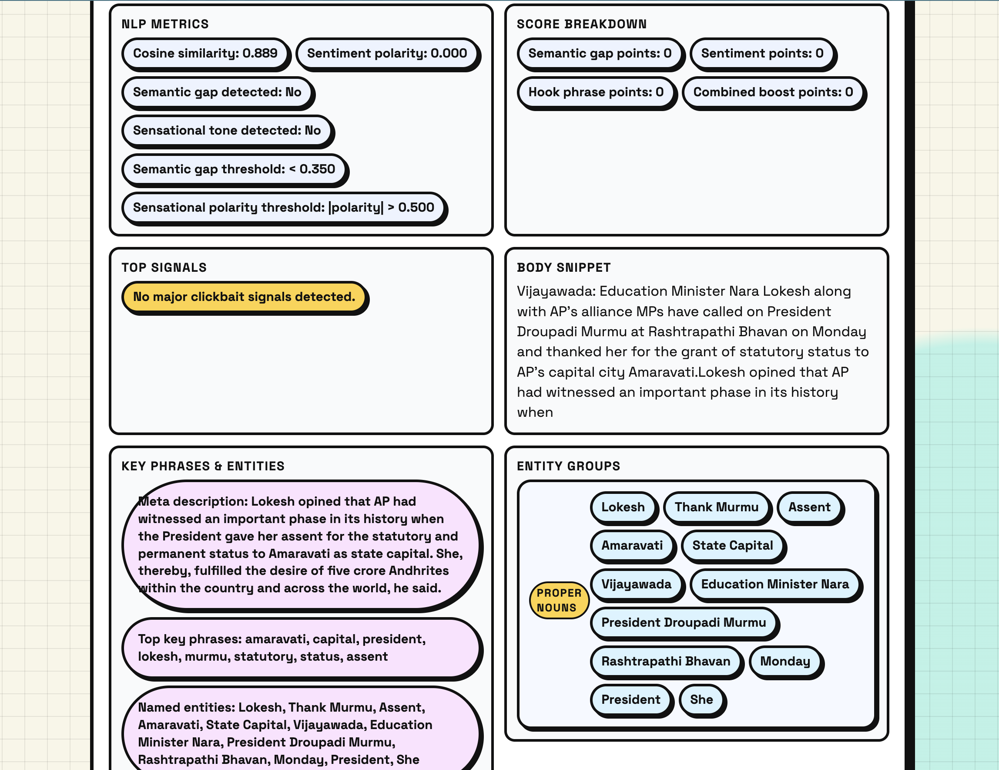

4. Deep details: key phrases, entity groups, and supporting sentences

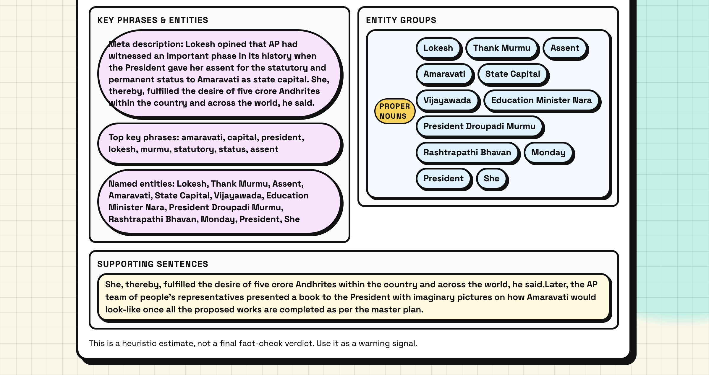

### Evaluation Charts

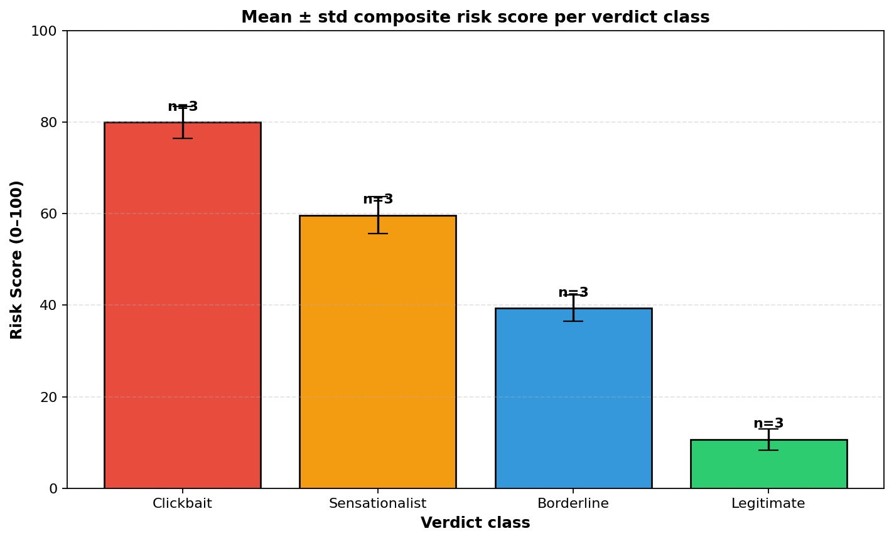
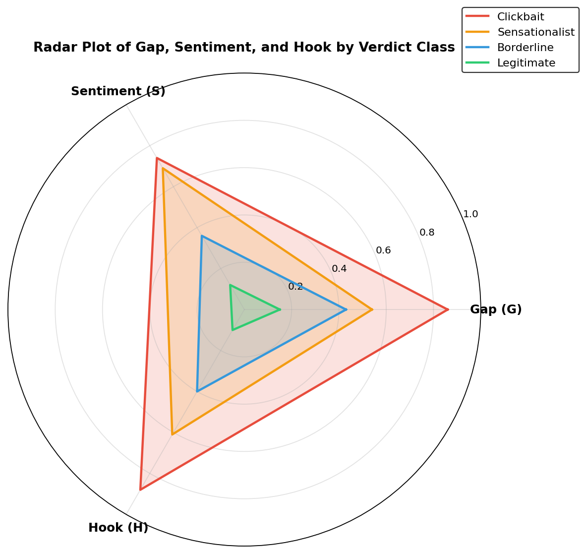
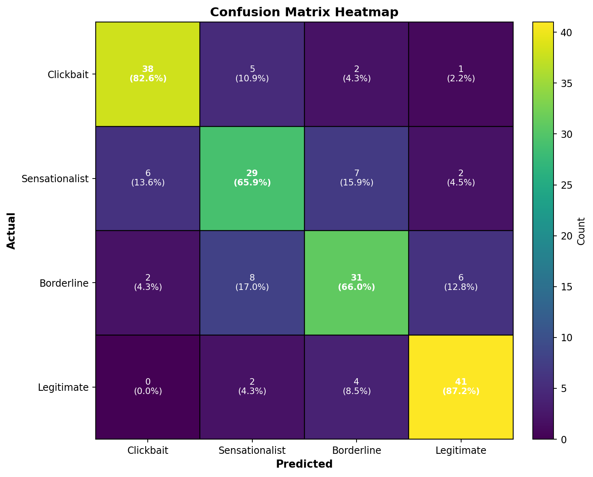

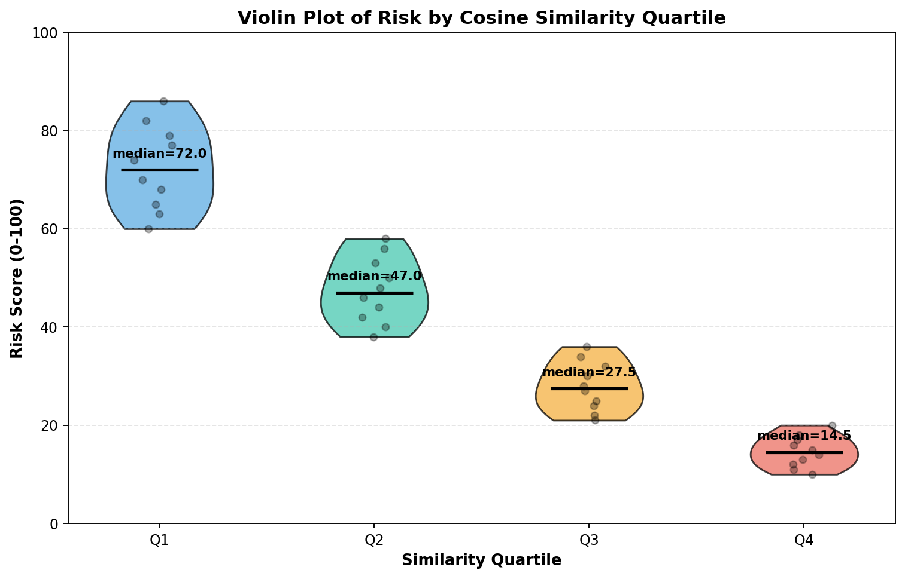
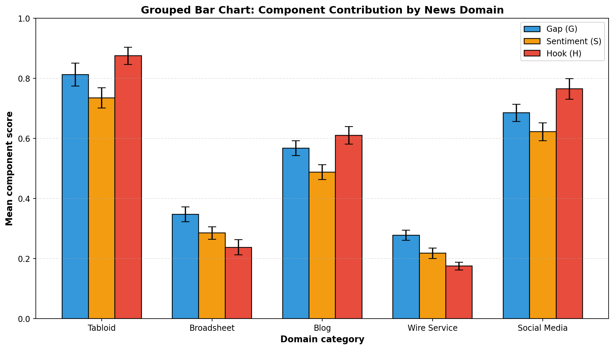
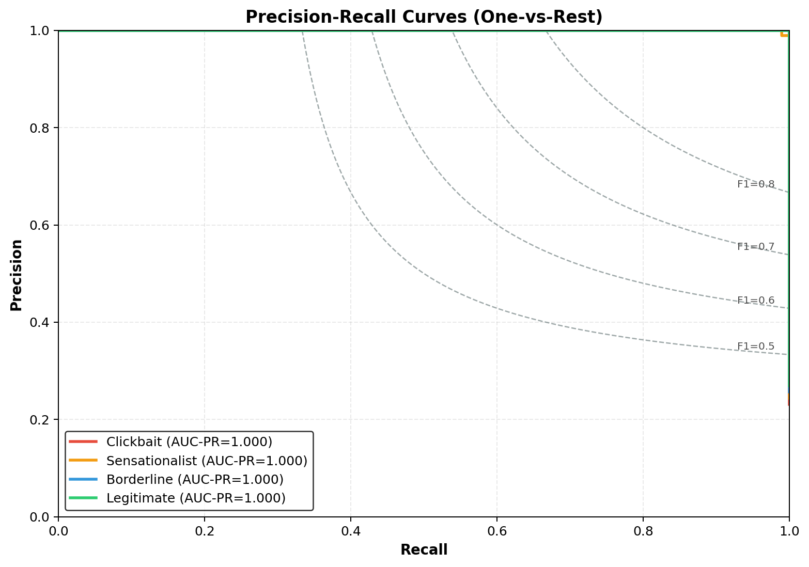
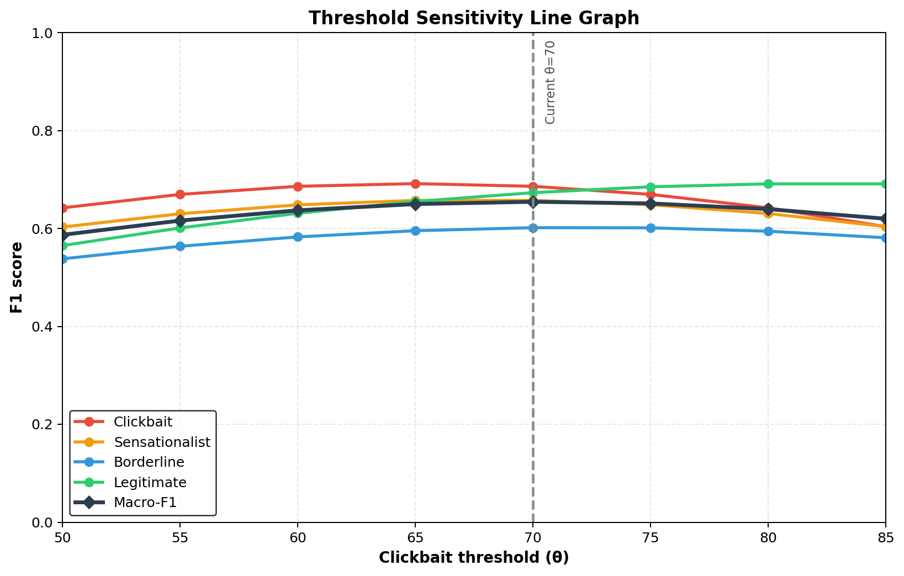

## GitHub About (Copy/Paste)

### Short Description

AI-powered clickbait detection web app that analyzes news URLs and scores headline credibility using explainable heuristic signals.

### Suggested Topics

`clickbait-detection`, `fake-news`, `nlp`, `news-analysis`, `javascript`, `nodejs`, `express`, `web-app`, `text-analysis`, `heuristics`

## Notes

- This is a heuristic estimate, not a final fact-check verdict.
- Some websites block automated fetch requests or render content dynamically, which can reduce extraction quality.
