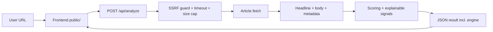

# BaitBlock — Clickbait & Headline Credibility Checker

Web app that analyzes a news article URL and estimates whether the headline is likely **clickbait or deceptive**, using explainable, content-based signals. It is a fast warning signal — **not** a fact-checker.


## What It Does

- Fetches article HTML from a URL **server-side, with SSRF protection**.
- Extracts the headline, readable body text, metadata, and supporting sentences.
- Detects clickbait patterns, sentiment intensity, and headline/body mismatch.
- Computes a composite 0–100 risk score with an **explainable signal breakdown**.
- Renders a themed, accessible results dashboard with a live risk gauge.

## Two Engines, One Contract

BaitBlock ships **two interchangeable backends** that implement the same `/api/analyze` contract and serve the same frontend. Pick one:

| Engine | Command | Stack | Notes |
|---|---|---|---|
| **Node (default)** | `npm start` | Express, Cheerio, regex heuristics | Zero ML deps, starts instantly. `cosine_similarity_score` is lexical overlap. |
| **Python (advanced)** | `./start.sh` (or `python app.py`) | Flask, spaCy, sentence-transformers, VADER | Real embeddings + NER + sentiment. `cosine_similarity_score` is a true SBERT cosine. |

Each response includes an `engine` field so the UI shows which one produced the result.

## Quick Start (Node)

```bash
npm install
npm start          # http://localhost:3000
```

Dev / quality commands:

```bash
npm run dev            # auto-reload (node --watch)
npm test               # unit + integration + frontend (node:test, zero extra runtime deps)
npm run lint           # ESLint
npm run format         # Prettier --write
```

If port 3000 is busy: `lsof -ti tcp:3000 | xargs kill -9 && npm start`.

## Quick Start (Python NLP engine)

```bash
python -m venv .venv && source .venv/bin/activate   # Windows: .venv\Scripts\activate
pip install -r requirements.txt
python -m spacy download en_core_web_sm             # required
python -m nltk.downloader vader_lexicon             # optional (sentiment; TextBlob fallback otherwise)
./start.sh            # macOS/Linux    (./start.sh --offline once models are cached)
# or:  .\start.ps1    # Windows
```

The first run downloads the sentence-transformer model (default `all-mpnet-base-v2`, ~420 MB) into `.cache/huggingface`. Override with `CLICKBAIT_EMBEDDING_MODEL` (e.g. `sentence-transformers/all-MiniLM-L6-v2` for a small/fast model, or `BAAI/bge-small-en-v1.5`).

## Architecture



The Node backend is modular: `config` · `ssrfGuard` · `safeFetch` · `extraction` · `scoring` · `nlp` · `analyze` (testable, network-injectable) · `server` (HTTP wiring). See `docs/Architecture.md`.

## Security

- **SSRF protection** on both engines: rejects `localhost`, RFC1918, loopback, link-local (incl. the `169.254.169.254` cloud-metadata endpoint), reserved ranges, IPv4-mapped IPv6, and non-`http(s)` schemes. Every redirect hop is re-validated (Node).
- **Rate limiting** on `/api/analyze` (Node, `express-rate-limit`).
- **Request timeout + response size cap + Content-Type allowlist** on outbound fetches (both engines).
- **Security headers** via Helmet with a strict CSP (all assets are same-origin; no external CDN).
- TLS verification is always on (the Python engine no longer silently falls back to `verify=False`).

Config knobs live in `.env.example`. For an internal/trusted deployment or local testing you can set `CLICKBAIT_ALLOW_PRIVATE=1` to allow private addresses — **keep it off for anything internet-facing**.

## API

### `POST /api/analyze`

Request: `{ "url": "https://example.com/article" }`

Key response fields: `verdict`, `composite_sensationalism_score`, `legitimacy_confidence_score`, `engine`, `headline`, `body_snippet`, `signals`, `score_breakdown`, `cosine_similarity_score`, `sentiment_polarity`, `entity_groups`, `supporting_sentences`.

Errors return `{ "error": "..." }` with an appropriate status (400 invalid/blocked URL, 413 too large, 415 not HTML, 429 rate-limited, 502/504 upstream failure). Full contract in `docs/API-Documentation.md`.

Also: `GET /healthz` → `{ "status": "ok" }`.

## Project Structure

```text
ClickbaitDetection/
  public/            index.html, script.js, theme.js, styles.css, robots.txt
  src/               server.js + config, ssrfGuard, safeFetch, extraction,
                     scoring, nlp, analyze, errors, textUtils, lexicons
  tests/             node:test — scoring, ssrf, analyze, api, frontend (jsdom)
  app.py             Python NLP engine (Flask)
  requirements.txt   pinned Python deps
  .github/           CI (lint + format + test on Node 18/20/22) + Dependabot
  docs/              full documentation set
```

## Screenshots

> Note: the screenshots below show the pre-redesign UI. The current interface is a themed (light/dark), gauge-based dashboard — run the app to see it. Refreshed screenshots welcome.


## Evaluation Charts

> **Disclaimer:** these figures are generated by `plot_*.py` from small, hand-authored sample CSVs. They are **illustrative of the scoring model's design**, not a measured benchmark of the shipped engine against a labeled corpus. A real evaluation harness is on the roadmap.


## Notes

- This is a heuristic estimate, not a final fact-check verdict.
- Some sites block automated fetches or render content via JavaScript, which reduces extraction quality.

## License

MIT — see [LICENSE](./LICENSE).
