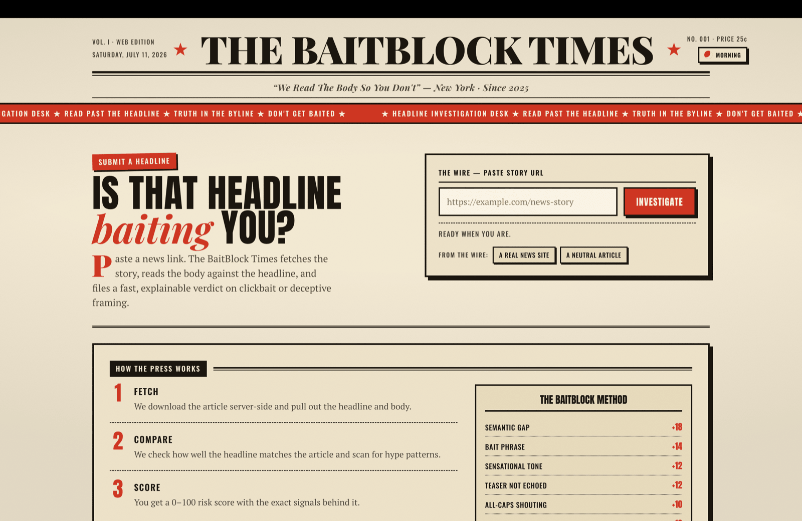
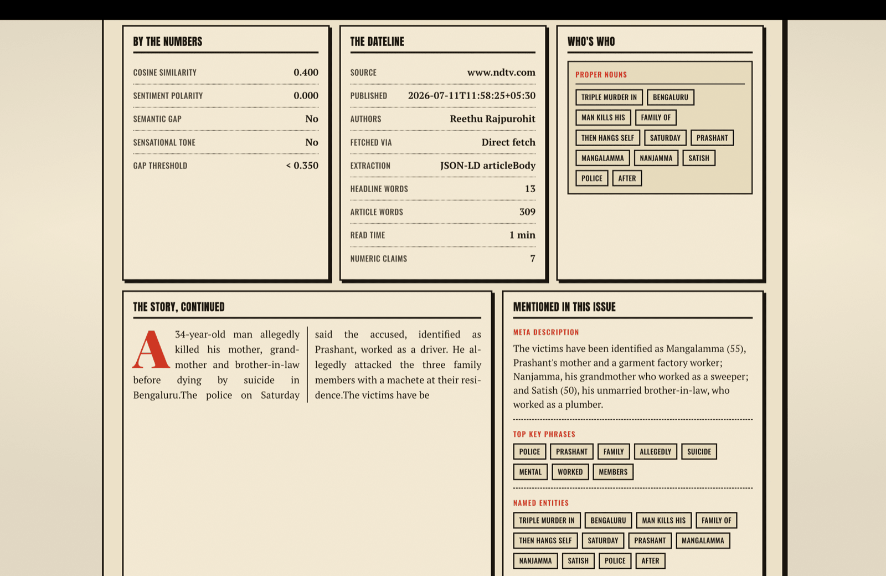
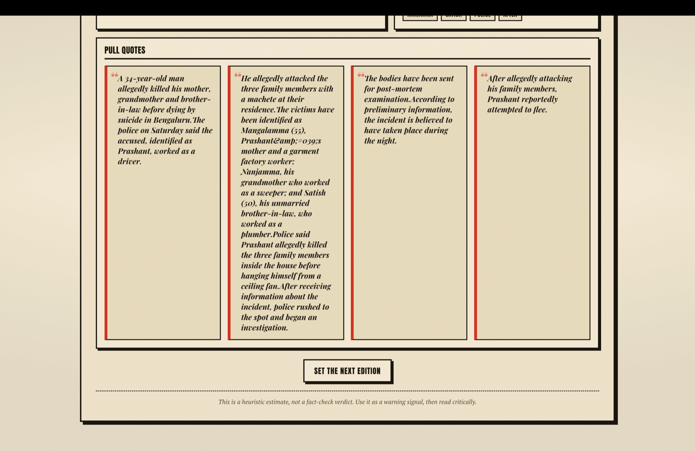
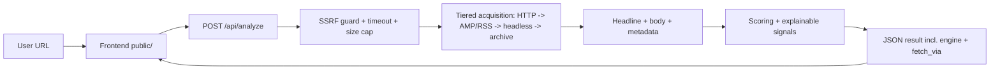

# The BaitBlock Times — Clickbait & Headline Credibility Checker

Paste a news article URL. BaitBlock fetches it server-side, reads the body against the headline,
and files a fast, explainable **0–100 clickbait/deception risk score** — styled as a neobrutalist
vintage newspaper front page. It is a warning signal, **not** a fact-checker.


## The Front Page

|                                    |                                          |
| ---------------------------------- | ---------------------------------------- |
|  |     |
| **Submit a headline**              | **The verdict — risk seal + stamp**      |
|  |  |
| **Full breakdown, entities & dateline** | **Pull quotes & fine print**        |

## What It Does

- Fetches article HTML from a URL **server-side, with SSRF protection**.
- **Tiered acquisition** (Node engine): direct HTTP with browser-realistic headers → AMP/RSS
  alternate routes → headless-browser rendering → public Wayback Machine archive fallback —
  built specifically to work around bot-walled news sites, while staying within legitimate means
  (robots.txt-respecting, rate-limited, no CAPTCHA-solving or proxy evasion).
- Extracts the headline, readable body text, metadata, and supporting sentences.
- Detects clickbait patterns, sentiment intensity, and headline/body mismatch.
- Computes a composite 0–100 risk score with an **explainable signal breakdown**.
- Renders a themed, accessible, front-page-dense results dashboard with a live risk gauge — light
  "Morning Edition" and dark "Evening Edition" themes.

## Two Engines, One Contract

BaitBlock ships **two interchangeable backends** that implement the same `/api/analyze` contract
and serve the same frontend. Pick one:

| Engine | Command | Stack | Notes |
|---|---|---|---|
| **Node (default)** | `npm start` | Express, Cheerio, tiered fetch pipeline, regex heuristics | Zero ML deps, starts instantly. `cosine_similarity_score` is lexical overlap. |
| **Python (advanced)** | `./start.sh` (or `python app.py`) | Flask, spaCy, sentence-transformers, VADER | Real embeddings + NER + sentiment. `cosine_similarity_score` is a true SBERT cosine. |

Each response includes an `engine` field so the UI shows which one produced the result, and a
`fetch_via` field (Node only) showing which acquisition tier succeeded.

## Quick Start (Node)

```bash
npm install
npx playwright install chromium   # optional — enables the headless-browser acquisition tier
npm start                          # http://localhost:3000
```

Dev / quality commands:

```bash
npm run dev            # auto-reload (node --watch)
npm test               # unit + integration + frontend (node:test, zero extra runtime deps)
npm run lint           # ESLint
npm run format          # Prettier --write
```

If port 3000 is busy: `lsof -ti tcp:3000 | xargs kill -9 && npm start`.

Requires **Node ≥20.18.1** (a transitive dependency, `undici` via `cheerio`, hard-requires it).

## Quick Start (Python NLP engine)

```bash
python -m venv .venv && source .venv/bin/activate   # Windows: .venv\Scripts\activate
pip install -r requirements.txt
python -m spacy download en_core_web_sm             # required
python -m nltk.downloader vader_lexicon             # optional (sentiment; TextBlob fallback otherwise)
./start.sh            # macOS/Linux    (./start.sh --offline once models are cached)
# or:  .\start.ps1    # Windows
```

The first run downloads the sentence-transformer model (default `all-mpnet-base-v2`, ~420 MB) into
`.cache/huggingface`. Override with `CLICKBAIT_EMBEDDING_MODEL` (e.g.
`sentence-transformers/all-MiniLM-L6-v2` for a small/fast model, or `BAAI/bge-small-en-v1.5`).

## Deploy

A [Render](https://render.com) Blueprint is included (`render.yaml`) — deploys the Node engine as
a persistent web service (required: the tiered fetch pipeline needs a long-lived process, not a
serverless function). In Render: **New → Blueprint**, select this repo, done. Free tier works;
see `render.yaml`'s comments for the RAM/idle-spin-down tradeoffs and the `CLICKBAIT_HEADLESS=0`
escape hatch if the headless tier is too heavy for your instance size.

## Architecture



The Node backend is modular: `config` · `ssrfGuard` · `safeFetch` · `acquire` (+ `altRoutes` ·
`headless` · `archive` · `robots` · `politeness` · `cache`) · `extraction` · `scoring` · `nlp` ·
`analyze` (testable, network-injectable) · `server` (HTTP wiring).

## Security

- **SSRF protection** on both engines: rejects `localhost`, RFC1918, loopback, link-local (incl.
  the `169.254.169.254` cloud-metadata endpoint), reserved ranges, IPv4-mapped IPv6, and
  non-`http(s)` schemes. Every redirect hop — and every headless-browser sub-resource request —
  is re-validated (Node).
- **Legitimate-only acquisition**: respects `robots.txt` by default, per-domain rate limiting,
  no CAPTCHA-solving/proxy-rotation/fingerprint-spoofing.
- **Rate limiting** on `/api/analyze` (Node, `express-rate-limit`).
- **Request timeout + response size cap + Content-Type allowlist** on outbound fetches (both
  engines).
- **Security headers** via Helmet with a strict CSP (all assets same-origin — fonts self-hosted,
  no external CDN of any kind).
- TLS verification is always on (the Python engine no longer silently falls back to
  `verify=False`).

Config knobs live in `.env.example`. For an internal/trusted deployment or local testing you can
set `CLICKBAIT_ALLOW_PRIVATE=1` to allow private addresses — **keep it off for anything
internet-facing**.

## API

### `POST /api/analyze`

Request: `{ "url": "https://example.com/article" }`

Key response fields: `verdict`, `composite_sensationalism_score`, `legitimacy_confidence_score`,
`engine`, `fetch_via`, `headline`, `body_snippet`, `signals`, `score_breakdown`,
`cosine_similarity_score`, `sentiment_polarity`, `entity_groups`, `supporting_sentences`.

Errors return `{ "error": "..." }` with an appropriate status (400 invalid/blocked URL, 413 too
large, 415 not HTML, 429 rate-limited, 502/504 upstream failure).

Also: `GET /healthz` → `{ "status": "ok" }`.

## Project Structure

```text
ClickbaitDetection/
  public/            index.html, script.js, theme.js, styles.css, robots.txt, fonts/
  src/               server.js + config, ssrfGuard, safeFetch, acquire (altRoutes, headless,
                     archive, robots, politeness, cache), extraction, scoring, nlp, analyze,
                     errors, textUtils, lexicons
  tests/             node:test — scoring, ssrf, analyze, api, frontend (jsdom)
  app.py             Python NLP engine (Flask)
  requirements.txt   pinned Python deps
  render.yaml        Render Blueprint (Node engine, persistent web service)
  .github/           CI (lint + format + test on Node 20/22) + Dependabot
  pictures/          current UI screenshots (this README)
  docs/              legacy documentation set
```

## Notes

- This is a heuristic estimate, not a final fact-check verdict.
- Some sites block automated fetches outright or need JavaScript to render content — the tiered
  acquisition pipeline recovers many of these, but a hard bot wall with no public archive copy is
  an honest ceiling, not a bug.

## License

MIT — see [LICENSE](./LICENSE).
