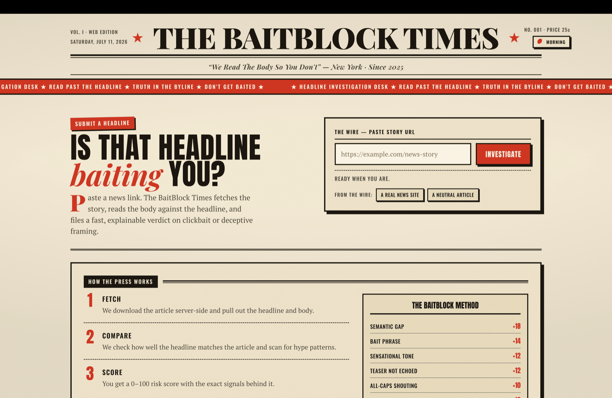
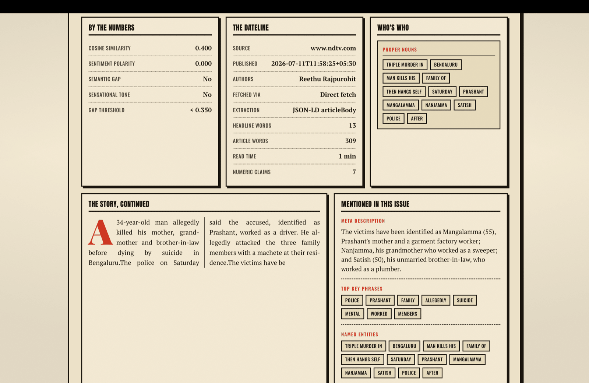
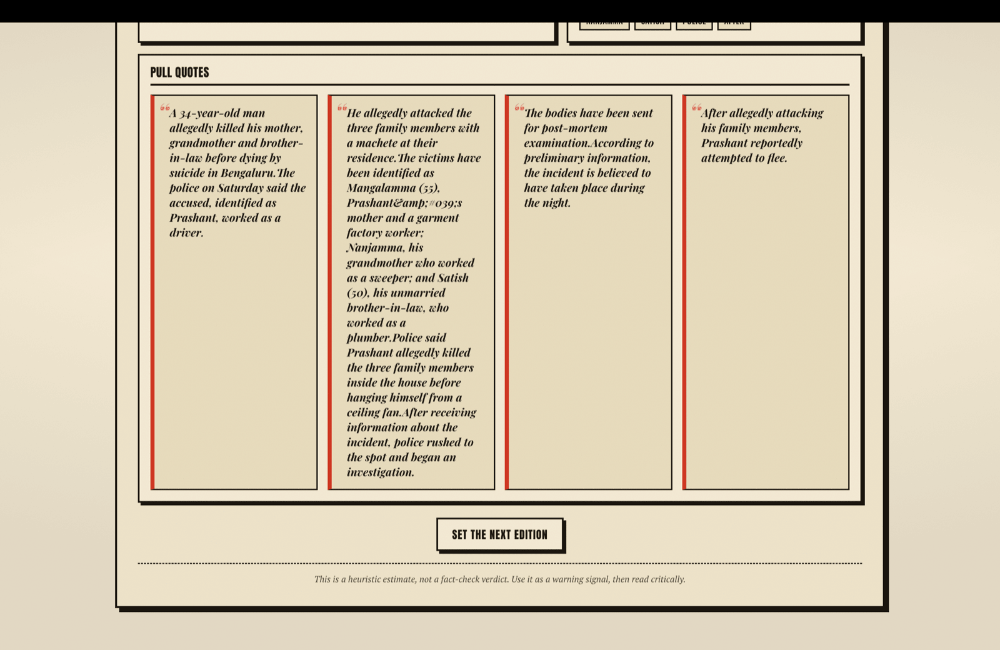
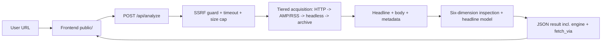

# The BaitBlock Times — Clickbait & Headline Credibility Checker

Paste a news article URL. BaitBlock fetches it server-side, reads the body against the headline,
and files a fast, explainable **0–100 clickbait/deception risk score** — styled as a neobrutalist
vintage newspaper front page. It is a warning signal, **not** a fact-checker.


## The Front Page

|                                    |                                          |
| ---------------------------------- | ---------------------------------------- |
|  |     |
| **Submit a headline**              | **The verdict — risk seal + stamp**      |
|  |  |
| **Full breakdown, entities & dateline** | **Pull quotes & fine print**        |

## What It Does

- Fetches article HTML from a URL **server-side, with SSRF protection**.
- **Tiered acquisition** (Node engine): direct HTTP with browser-realistic headers (retried once
  on transient errors) → AMP/RSS alternate routes → headless-browser rendering (Playwright's
  Chromium, or your installed Chrome/Edge) → public Wayback Machine archive — while staying within
  legitimate means (robots.txt-respecting, rate-limited, no CAPTCHA-solving or proxy evasion).
- **Extraction that doesn't depend on `<p>` tags**: publisher JSON-LD, paragraph selectors, and
  Mozilla Readability (Firefox Reader View's algorithm) for sites built from `<div>`/`<span>` blocks.
- **Never a dead end**: if a site walls off automated readers entirely, you still get a clearly
  labelled *Headline Only* read of the link's words (15% confidence, page checks marked N/A);
  links that genuinely don't exist get a plain 404.
- Extracts the headline, readable body text, byline, date, publisher and page-type metadata.
- Runs a **six-dimension inspection** (below) and returns a 0–100 risk score, a five-tier verdict
  that **names the kind of problem** (not just "clickbait yes/no"), the exact evidence behind every
  point, what checks out, what to verify, and what to do before sharing.
- Highlights the exact headline words that triggered the checks, extracts people / places /
  organizations, the sentences that back the headline, and check-worthy claims.
- Renders a themed, accessible, front-page-dense results dashboard with a live risk gauge — light
  "Morning Edition" and dark "Evening Edition" themes.

## How The Verdict Is Made

Six independent checks, each scored 0–100 with every point traceable to a named signal:

| Dimension | What it looks for |
|---|---|
| **Headline bait** | A learned headline-style model (below) plus curiosity-gap phrasing, stock bait phrases, forward references ("this", "here's"), listicles, direct address, teaser ellipses |
| **Sensational tone** | Loaded/hyperbolic words (weighted), intensifiers, exclamation marks, ALL-CAPS, emoji; loaded-language density in the body. Quoted speech counts half |
| **Headline vs. body** | Stemmed coverage of the headline's key terms in the body, its opening, and its best-matching passage; headline figures and names missing from the body; a headline that states as certain what the body hedges ("cures" vs "may be linked to"). The Python engine adds SBERT semantic similarity |
| **Weak sourcing** | Attributed statements per 100 words, direct quotes, data/study references vs anonymous sourcing ("sources say", "experts warn") and rumor wording |
| **Low transparency** | Missing byline, date or publisher, plain HTTP, sponsored/paid labels; context labels for Opinion, Press release, Satire and Old story |
| **Manipulation & scam tactics** | Artificial urgency, sales CTAs, miracle-cure and get-rich-quick claims, conspiracy framing, share pressure, prize/verification lures, **lookalike outlet domains** (`abcnews.com.co`) |

Dimensions combine as a **noisy-OR with a dead zone**: one strong red flag is enough to raise the
score, several moderate ones compound, and faint noise across many checks doesn't add up.

| Score | Tier | Verdict |
|---|---|---|
| 0–19 | minimal | Straight Reporting |
| 20–39 | low | Likely Legit |
| 40–59 | moderate | Borderline |
| 60–79 | high | Named by the main concern: Clickbait · Sensationalist · Misleading Headline · Unsubstantiated · Low Transparency · Manipulative |
| 80–100 | severe | (same, severe) |

Satire sites and sponsored content get their own verdicts below the high tier. Each result also
carries an **analysis confidence** (how much usable text there was), separate from the risk score.

### Headline model accuracy (measured)

The headline-style model is a logistic regression over unigram/bigram features, trained by
`npm run train:headline` on the public *Stop Clickbait* corpus (Chakraborty et al., ASONAM 2016;
16k clickbait + 16k news headlines). On a held-out 20% split (6,400 headlines, seed 42):
**accuracy 98.2%, precision 98.5%, recall 97.8%, F1 0.981**. Weights ship in
`src/data/headline-model.json`; the corpus itself is not committed. This measures the *headline*
check only — there is no labelled full-article corpus here, so the article-level dimensions are
pinned by contract tests over seven article archetypes (wire news, clickbait, misleading science,
scam, anonymous rumor, sponsored, satire) rather than a benchmark number.

## Two Engines, One Contract

BaitBlock ships **two interchangeable backends** that implement the same `/api/analyze` contract
and serve the same frontend. Pick one:

| Engine | Command | Stack | Notes |
|---|---|---|---|
| **Node (default)** | `npm start` | Express, Cheerio, compromise (NER), tiered fetch pipeline | No ML runtime, starts instantly. `cosine_similarity_score` is stemmed lexical alignment. |
| **Python (advanced)** | `./start.sh` (or `python app.py`) | Flask, spaCy, sentence-transformers, VADER | Adds SBERT semantic similarity + spaCy NER. `cosine_similarity_score` is a true SBERT cosine. |

Both engines read the same signal definitions (`src/data/rules.json`) and headline model, so their
verdicts agree on the contract fixtures (`tests/test_app.py` checks the Python side).

Each response includes an `engine` field so the UI shows which one produced the result, and a
`fetch_via` field (Node only) showing which acquisition tier succeeded.

## Quick Start (Node)

```bash
npm install
npx playwright install chromium   # optional — enables the headless-browser acquisition tier
npm start                          # http://localhost:3000
```

Dev / quality commands:

```bash
npm run dev            # auto-reload (node --watch)
npm test               # unit + integration + frontend (node:test, zero extra runtime deps)
npm run lint           # ESLint
npm run format          # Prettier --write
npm run train:headline  # retrain the headline model (needs the corpus in .cache/clickbait-data)
```

If port 3000 is busy: `lsof -ti tcp:3000 | xargs kill -9 && npm start`.

Requires **Node ≥20.18.1** (a transitive dependency, `undici` via `cheerio`, hard-requires it).

## Quick Start (Python NLP engine)

```bash
python -m venv .venv && source .venv/bin/activate   # Windows: .venv\Scripts\activate
pip install -r requirements.txt
python -m spacy download en_core_web_sm             # required
python -m nltk.downloader vader_lexicon             # optional (sentiment; TextBlob fallback otherwise)
./start.sh            # macOS/Linux    (./start.sh --offline once models are cached)
# or:  .\start.ps1    # Windows
```

The first run downloads the sentence-transformer model (default `all-mpnet-base-v2`, ~420 MB) into
`.cache/huggingface`. Override with `CLICKBAIT_EMBEDDING_MODEL` (e.g.
`sentence-transformers/all-MiniLM-L6-v2` for a small/fast model, or `BAAI/bge-small-en-v1.5`).

## Deploy

A [Render](https://render.com) Blueprint is included (`render.yaml`) — deploys the Node engine as
a persistent web service (required: the tiered fetch pipeline needs a long-lived process, not a
serverless function). In Render: **New → Blueprint**, select this repo, done. Free tier works;
see `render.yaml`'s comments for the RAM/idle-spin-down tradeoffs and the `CLICKBAIT_HEADLESS=0`
escape hatch if the headless tier is too heavy for your instance size.

## Architecture


```mermaid
flowchart LR
   U[User URL] --> FE[Frontend public/]
   FE --> API[POST /api/analyze]
   API --> SSRF[SSRF guard + timeout + size cap]
   SSRF --> ACQ[Tiered acquisition: HTTP -> AMP/RSS -> headless -> archive]
   ACQ --> EXTRACT[Headline + body + metadata]
   EXTRACT --> SCORE[Six-dimension inspection + headline model]
   SCORE --> RES[JSON result incl. engine + fetch_via]
   RES --> FE
```

The Node backend is modular: `config` · `ssrfGuard` · `safeFetch` · `acquire` (+ `altRoutes` ·
`headless` · `archive` · `robots` · `politeness` · `cache`) · `extraction` · `scoring` · `nlp` ·
`analyze` (testable, network-injectable) · `server` (HTTP wiring).

## Security

- **SSRF protection** on both engines: rejects `localhost`, RFC1918, loopback, link-local (incl.
  the `169.254.169.254` cloud-metadata endpoint), reserved ranges, IPv4-mapped IPv6, and
  non-`http(s)` schemes. Every redirect hop — and every headless-browser sub-resource request —
  is re-validated (Node).
- **Legitimate-only acquisition**: respects `robots.txt` by default, per-domain rate limiting,
  no CAPTCHA-solving/proxy-rotation/fingerprint-spoofing.
- **DNS-rebinding safe** (Node): SSRF validation runs inside the socket's DNS lookup, so the
  address dialled is the address checked. The Python engine validates every redirect hop itself.
- **Same-origin, JSON-only API**: cross-site POSTs (by `Origin` / `Sec-Fetch-Site`) get 403, non-JSON
  bodies 415; no CORS headers are ever sent. This is the CSRF defence: there are no cookies or sessions.
- **Abuse limits** (both engines): per-IP rate limiting, a server-wide cap on concurrent analyses
  (503 when full), 4 KB request bodies, 2,048-char URLs; Node also caps concurrent headless renders.
- **Security event log**: one JSON line per blocked SSRF attempt, cross-origin request, rate-limit
  hit, oversized body or capacity rejection (`"type":"security"` on stderr).
- **Request timeout + response size cap + Content-Type allowlist** on outbound fetches (both
  engines).
- **Security headers** on both engines: HSTS, a strict CSP with no `unsafe-inline`, nosniff,
  frame-ancestors none, Referrer-Policy, Permissions-Policy. Errors never include stack traces or
  internal details.
- TLS verification is always on (the Python engine no longer silently falls back to
  `verify=False`).

Config knobs live in `.env.example`. For an internal/trusted deployment or local testing you can
set `CLICKBAIT_ALLOW_PRIVATE=1` to allow private addresses — **keep it off for anything
internet-facing**.

## API

### `POST /api/analyze`

Request: `{ "url": "https://example.com/article" }`

Key response fields: `verdict`, `tier`, `risk_level`, `bucket`, `primary_concern`, `score`,
`dimensions[]` (each with `score` and `signals[]`), `strengths`, `context_labels`, `guidance`,
`headline_highlights`, `headline_model`, `analysis_confidence`, `claims_to_verify`,
`supporting_sentences`, `entity_groups`, plus the legacy fields. Full contract:
[docs/API-Documentation.md](./docs/API-Documentation.md).

Errors return `{ "error": "..." }` (400 invalid/blocked URL, 403 cross-origin, 413 body too large,
414 URL too long, 415 not JSON / not HTML, 429 rate-limited, 502/504 upstream failure, 503 busy).

Also: `GET /healthz` → `{ "status": "ok" }`.

## Project Structure

```text
ClickbaitDetection/
  public/            index.html, script.js, theme.js, styles.css, robots.txt, fonts/
  src/               server.js + config, ssrfGuard, safeFetch, acquire (altRoutes, headless,
                     archive, robots, politeness, cache), extraction, scoring, headlineModel,
                     nlp, analyze, errors, textUtils
  src/data/          rules.json (shared signal definitions), headline-model.json (learned weights)
  scripts/           train-headline-model.js
  tests/             node:test — scoring, ssrf, analyze, api, frontend (jsdom); test_app.py (Python)
  app.py             Python NLP engine (Flask)
  requirements.txt   pinned Python deps
  render.yaml        Render Blueprint (Node engine, persistent web service)
  .github/           CI (lint + format + test on Node 20/22) + Dependabot
  pictures/          current UI screenshots (this README)
  docs/              legacy documentation set
```

## Notes

- BaitBlock judges framing and sourcing, not truth. It is a warning signal, not a fact-check.
- The lexicons and headline model are English-only; non-English pages get a low analysis confidence.
- Reliability, measured on live RSS links from ~30 outlets: every link returned a result; ~75%
  were full-article reads. Hard bot walls (NYT, Forbes, Sky News, Ars Technica at the time of
  testing) yield only a Headline Only read until a public archive copy exists. Getting past those
  would need CAPTCHA-solving or evasion, which this project deliberately doesn't do.

## License

MIT — see [LICENSE](./LICENSE).
