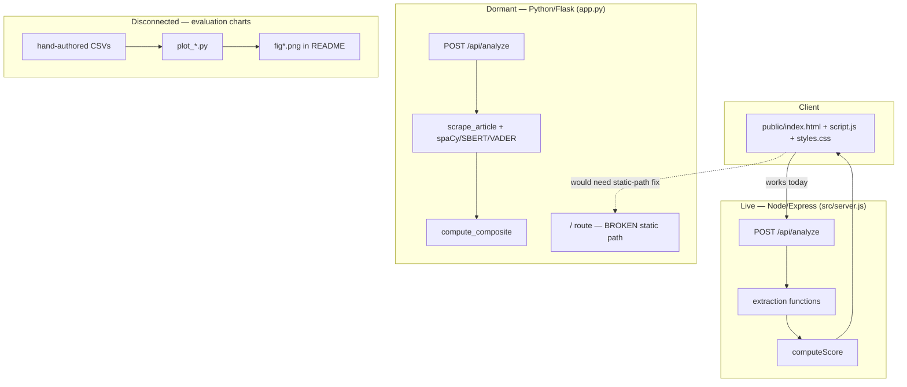

# SYSTEM_OVERVIEW.md

> **Updated for v1.1.0.** The "one only works / two decoy root files / illustrative charts" notes below are partly superseded: **both engines now work**, the duplicate root files were **deleted**, and the charts now carry a disclaimer. The app is hardened + tested. See [[CHANGELOG]].

One-page mental model for a new AI session or new contributor.

## The App in One Sentence

Paste a news URL → server fetches and parses it → heuristic/NLP scoring compares headline against body and scans for clickbait phrasing → browser shows a color-coded risk verdict with an explainable breakdown.

## The System in One Diagram

## The Three Things to Never Forget About This Repo

1. **Two backends, one frontend, one only actually works.** Node/Express is live; Python/Flask is dormant due to a broken static-file path.
2. **Two root-level files are decoys.** `script.js` and `server.js` at repo root are untracked dead duplicates of the real `public/script.js` and `src/server.js`.
3. **The README's evaluation charts are illustrative, not measured.** They come from small hand-authored CSVs, not from running this app against real data.

## Full Reference

`docs/` (20 files) and `knowledge-base/` (Obsidian vault with diagrams) contain the complete analysis this summary is drawn from.
