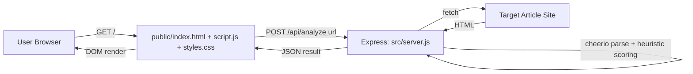
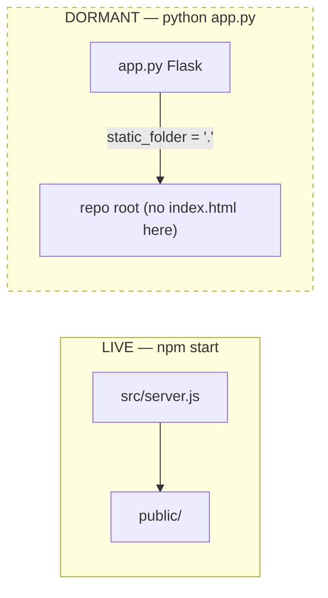

# Architecture

> **Updated for v1.1.0 (2026-07-11).** Two changes supersede parts of the description below:
> 1. The Node backend is **no longer a single file** — `src/server.js` was split into modules: `config`, `ssrfGuard`, `safeFetch`, `extraction`, `scoring`, `nlp`, `analyze` (orchestration, network-injectable for tests), `errors`, `textUtils`, `lexicons`, and a thin `server` for HTTP wiring.
> 2. The **Python backend now works** — its broken static path was fixed, so it serves `public/` and is a fully reachable alternate engine (see [[../CHANGELOG]]). Passages below that call it "dormant/broken" describe the pre-upgrade state.
>
> A request now flows: `POST /api/analyze` → helmet/rate-limit → `analyze.js` → `safeFetch` (SSRF guard + timeout + size cap + content-type) → `extraction` → `scoring` → JSON (with an `engine` field). Both engines apply the same SSRF/fetch protections.

## Style

A classic **server-rendered-static + JSON API** monolith — not a SPA framework, no client-side router, no build pipeline. One Express process serves static assets and one POST endpoint. There is no service boundary, no queue, no database; the "architecture" is really a single request/response pipeline executed synchronously per analysis.

## The Two-Backend Situation

The repo contains a second, architecturally distinct pipeline that is never invoked by the live app:

`app.py` configures `Flask(__name__, static_folder=".", static_url_path="")` and its `/` route does `send_from_directory(".", "index.html")` — relative to the repo root where `app.py` lives. But `index.html` only exists inside `public/`. Visiting `/` on the Flask server would 404. This backend was clearly designed against the same frontend contract (identical response field names: `verdict`, `composite_sensationalism_score`, `score_breakdown`, `entity_groups`, etc.) but the static wiring was never finished or was broken by a later refactor that moved the frontend into `public/`. See [[Known-Issues]] for the full list of consequences.

## Request Pipeline (live Node backend)

1. **Transport** — Express receives `POST /api/analyze` with `{ url }`.
2. **Validation** — `new URL(url)` must succeed and protocol must be `http:`/`https:`; otherwise 400.
3. **Fetch** — server-side `fetch()` with a custom `User-Agent`, following redirects. Non-2xx → 400 with the upstream status echoed.
4. **Parse** — `cheerio.load(html)` builds a jQuery-like DOM; JSON-LD `<script>` blocks are parsed separately for structured metadata.
5. **Extraction** — title, body, meta description, published date, authors (see [[Data-Flow]] for the fallback chains).
6. **Scoring** — `computeScore(title, bodyText)` runs entirely in-process, synchronously, no external calls (see [[Features]] for the signal list).
7. **Response shaping** — a single large JSON object is returned; verdict/bucket/confidence are derived from the numeric score at request time (no persisted state).
8. **Fallback route** — `app.get("*", ...)` serves `index.html` for any other path (SPA-style catch-all), even though there is no client-side router to make use of it.

## Design Patterns Observed

- **Fallback-chain extraction** — both backends layer multiple extraction strategies (JSON-LD → semantic selectors → generic paragraph scan) and take the first one that clears a quality bar. This is the most deliberate, well-thought-out part of the codebase.
- **Explainable scoring** — score is decomposed into named sub-components (`semantic_gap_points`, `sentiment_points`, `hook_points`, `synergy_points`) returned alongside the total, rather than a black-box number.
- **No separation of concerns within `server.js`** — extraction, scoring, and HTTP handling all live in one 685-line file with only function-level modularity (no modules/classes, no dependency injection). Fine at this size, would not scale past a few more features without splitting.
- **Frontend normalizes server shape** — `public/script.js`'s `normalizeApiResponse()` defensively fills in every field with a default, which is what lets the same frontend tolerate *either* backend's response shape (Node's `bucket`-derived verdict vs Python's native `verdict` field) — indirect evidence the two backends were meant to be interchangeable.

## Data Flow Summary

See [[Data-Flow]] for the full extraction fallback chains and [[API-Documentation]] for the wire contract.
