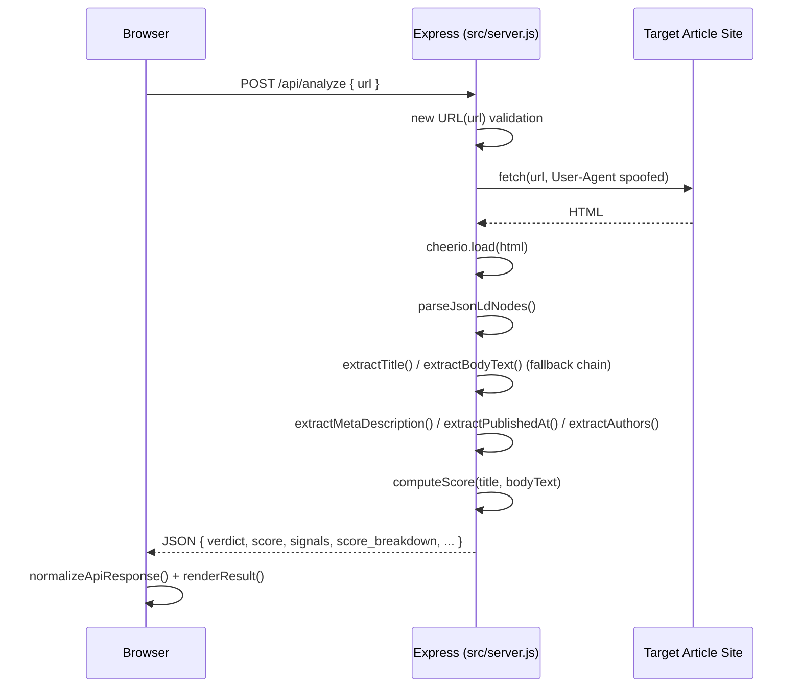
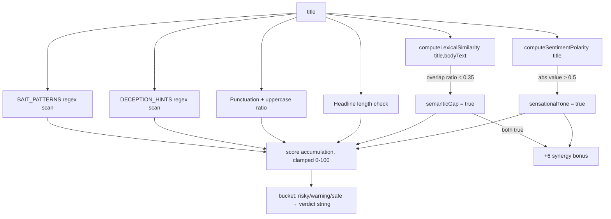
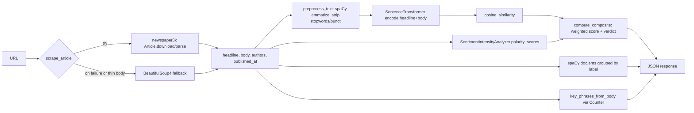
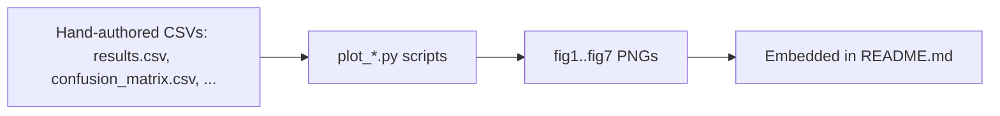

# Data Flow

## End-to-End (Live Node Backend)

## Title Extraction Fallback Chain

`og:title` meta → `twitter:title` meta → first `<h1>` text → `<title>` tag text → (first non-empty wins).

## Body Extraction Fallback Chain

1. Prune noisy DOM nodes: `script`, `style`, `nav`, `footer`, `header`, `aside`, ad/cookie/consent/analytics/tracking/share/related/comment selectors.
2. Try JSON-LD `articleBody` from any `NewsArticle`/`Article`/`Report`-typed node — used if length > 220 chars and not "noisy."
3. Try a ranked list of CSS selectors (`article p`, `main p`, `[role='main'] p`, `.article p`, `.post-content p`, `.entry-content p`, `.story-content p`, `.content p`), keeping paragraphs that pass `isReadableParagraph` (≥60 chars, ≥10 words, ≤2 excessively long "words", not boilerplate like "cookie"/"subscribe"/"privacy policy"). Accepts the first selector whose combined text is ≥80 tokens and >200 chars.
4. Fallback: all `
` tags on the page, same readability filter, first 20, if combined length > 200 chars.
5. Final fallback: same scan scoped to `<body>` only; if still noisy, body text is empty and the API surfaces `"No readable article body found"` as the extraction method.

Every step records which method succeeded (`extraction_method` in the response) — this is one of the more useful debugging fields in the payload.

## Scoring Data Flow

`computeLexicalSimilarity` is **not** semantic similarity despite the field name `cosine_similarity_score` — it's a plain set-intersection ratio of non-stopword tokens between headline and body. The Python backend (`app.py`) computes a *real* cosine similarity over sentence embeddings for the same field name, which means the two backends' `cosine_similarity_score` values are not comparable even though they share a field name and threshold (0.35).

## Data Flow — Python Backend (for reference; not currently reachable, see [[Known-Issues]])

## Evaluation/Chart Data Flow (disconnected side pipeline)

No arrow exists from either live server into this pipeline — the CSVs are not generated by running the app.
