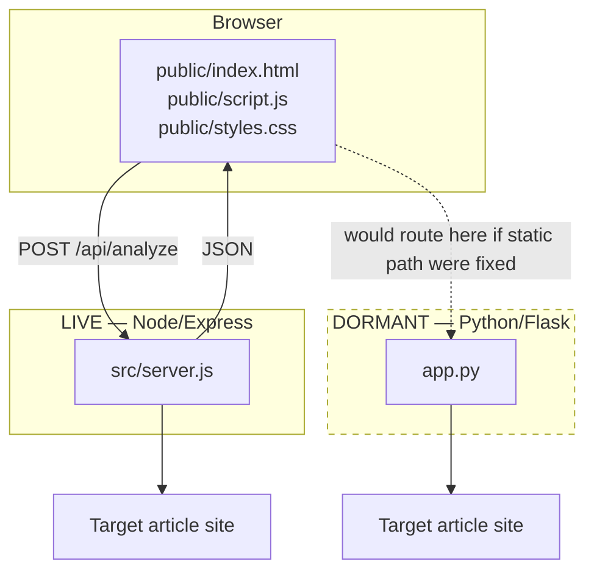

# System Architecture

Parent: [[Home]]

## Overview

BaitBlock is a stateless static-frontend + JSON-API monolith, duplicated across two independent backend implementations. See [[Node-Backend]] and [[Python-Backend]].



## Why Two Backends

See [[Decision-Log]] (in `../../docs/`) for the reconstructed reasoning: the Node backend is the simple, dependency-light version that's actually shipped (`package.json` points at it); the Python backend appears to be a parallel, more sophisticated NLP prototype (real embeddings, real NER, real sentiment) that was never fully wired to the frontend it was clearly built against — same JSON contract, same field names, but a broken static-file path.

## Layers

Neither backend uses MVC or a service/repository pattern. Each is a single file organized as:

```
HTTP route handlers
    → extraction functions (headline, body, metadata)
        → scoring functions (compute the 0-100 risk score)
            → small pure helpers (tokenize, clamp, normalize whitespace)
```

## Related

- [[Node-Backend]]
- [[Python-Backend]]
- [[Frontend]]
- [[Request-Lifecycle]]
