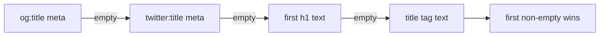
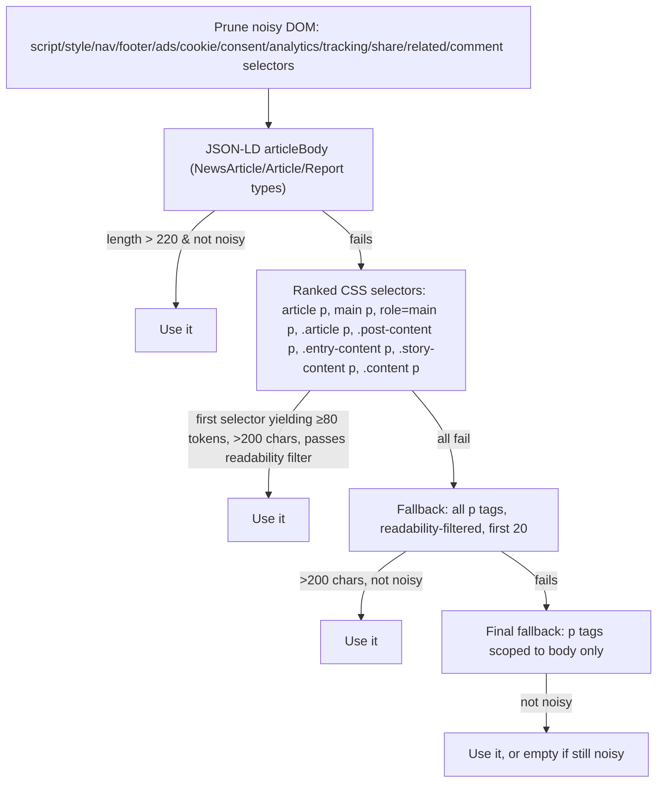

# Extraction Fallback Chains

Parent: [[Home]]

Both backends independently implement the same idea: real-world article HTML is inconsistent, so try several strategies in order of trustworthiness and take the first one that clears a quality bar.

## Title (Node: `extractTitle`)

## Body (Node: `extractBodyText`)

`isReadableParagraph` filters out anything under 60 chars, under 10 words, containing boilerplate phrases ("cookie", "subscribe", "privacy policy", "sign in", "disclaimer"), or with more than 2 abnormally long "words" (a proxy for encoded/minified junk). `isNoisyTextCandidate` additionally flags text with ≥2 tracking/ad-related keyword hits, high punctuation density, or low alphabetic-character ratio.

The response's `extraction_method` field records which tier succeeded — useful for debugging why a given article extracted poorly.

## Python Equivalent

`app.py`'s `scrape_article()` is coarser — two tiers only: `newspaper3k` (used if it returns both a headline and >180 chars of body), else BeautifulSoup4 with a shorter selector list (`article`, `main`, `[role='main']`, `.post-content`, `.entry-content`, else raw `
` tags with no readability filtering at all). See [[Python-Backend]].

## Related

- [[Request-Lifecycle]]
- [[Node-Backend]]
- [[Python-Backend]]
