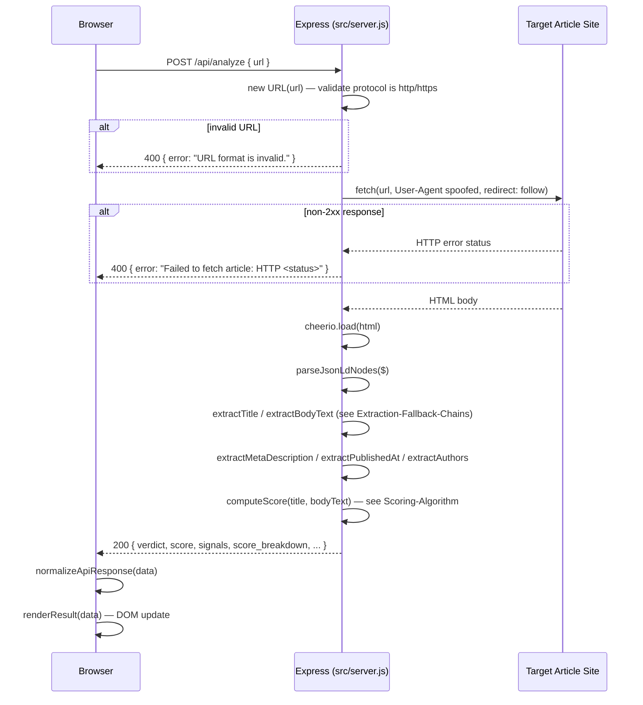

# Request Lifecycle

Parent: [[Home]]

## Full Sequence (Node/live backend)

## Failure Paths

Any exception during fetch/parse/extract/score is caught by a single outer `try/catch` and returned as `500 { error: "Could not analyze this URL right now...", detail: error.message }` — a client-visible message but no server-side logging beyond the default Express/Node stderr trace.

## Related

- [[Extraction-Fallback-Chains]]
- [[Scoring-Algorithm]]
- [[Node-Backend]]
