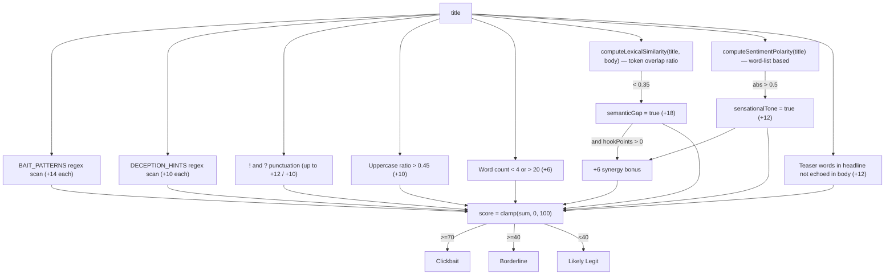

# Scoring Algorithm

Parent: [[Home]]

## Node (`computeScore`, live)



Special case: if no title could be extracted at all, the function short-circuits to a fixed score of 65 with a single signal explaining why, rather than running the full pipeline against an empty string.

## Python (`compute_composite`, dormant)

Weighted-component formula instead of additive point accumulation:

```
gap_component = clamp((0.35 - similarity) / 0.35, 0, 1)         # 0 if no gap
sentiment_component = clamp(abs(polarity), 0, 1)
hook_bonus = sum of 0.12 per matched pattern, capped at 0.35

composite = gap_component * 58
          + sentiment_component * 28
          + hook_bonus * 40
          + (8 if semantic_gap and sensational_tone else 0)

score = round(clamp(composite, 0, 100))
```

Verdict logic is 4-way and conditional rather than pure score cutoffs:
- `semantic_gap AND sensational_tone AND score >= 65` → **Clickbait**
- `sensational_tone AND score >= 45` → **Sensationalist**
- `score >= 35 OR semantic_gap` → **Borderline**
- else → **Legitimate**

## The Critical Divergence

Both engines threshold `similarity < 0.35` to declare a "semantic gap," but:
- Node's `similarity` = lexical token-overlap ratio (`computeLexicalSimilarity`) — cheap, no ML, but crude (synonyms, paraphrasing, and different word choice all falsely register as a "gap" even when the headline accurately represents the body).
- Python's `similarity` = SBERT sentence-embedding cosine similarity (`semantic_similarity`) — captures actual meaning overlap, immune to simple synonym swaps.

Same threshold value, different underlying metric, different real-world calibration. Migrating from one engine to the other without recalibrating the threshold would silently change the tool's behavior. See [[Known-Issues]].

## Related

- [[Node-Backend]]
- [[Python-Backend]]
- [[Request-Lifecycle]]
